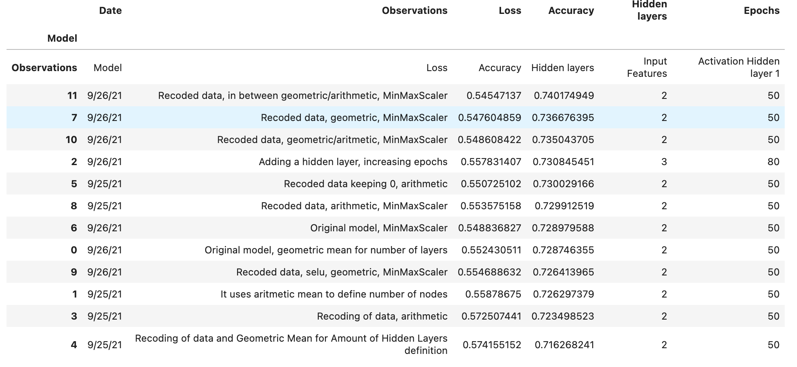

# Venture Funding with Deep Learning
This projects aims to predict the success or fail of loans provided to Venture Capital companies. 
Several Deep Learning models are applied and compared in terms of performance. Partf of the model that have been manipulated include the number of layers, the activation functions, the recoding of the data, the standarization versus normalization of the data in preparation, the number of epochs, and the methods applied to categorical data.

## Technologies

The project uses the following technologies:

* *Pandas, NumPy* for general programming in Jupyter Lab

* *TensorFlow* and *Keras* for the construction and evaluation of the Deep Learning models. Particularly *Sequential* for the fitting, compilation and evaluation, and *Dense* for the layer construction. We use a version above 2.0.0.

* *SKLearn* for the preprocessing of the data, particularly *StandardScaler* and *MinMaxScaler* for standarization and normalization; *OneHotEncoder* for treatment of the categorical variables, and *train_test_split* for the separation of the sample in a set to train and a set to validate the model.

## Instalation Guide
The file is a jupyter notebook. If you don't have jupyter lab, you can install it following the instruction here:

https://jupyterlab.readthedocs.io/en/stable/getting_started/installation.html

If you don't have installed TensorFlow, you can run the following command

`pip install --upgrade tensorflow`

### Usage

The main file is `venture_funding_with_deep_learning.ipynb`, which contains the original model. Others similarly called files are different alternative models (such as `1venture_funding_with_deep_learning_Alternative.ipynb`, `2venture_funding_with_deep_learning_Alternative.ipynb`and so on).

Results and comparison are done on the original model file.

These are jupyter notebooks with a pre-run code. You can go through it and see code as well as results. 

If you look to reuse the code, and do not have experience on jupyter lab, please refer:
https://www.dataquest.io/blog/jupyter-notebook-tutorial/

The table of final results of all models is as in the table below, with a very small description of the variation on ther Observation columns. For the details of the model construction, you must go to the model file itself.

## Contributors
This project was coded by Paola Carvajal Almeida, paola.antonieta@gmail.com.

Contact email: paola.antonieta@gmail.com
LinkedIn profile: https://www.linkedin.com/in/paolacarvajal/

## License
This project uses a MIT license. This license allows you to use the licensed material at your discretion, as long as the original copyright and license are included in your work files. This license does not contain a patent grant,  and liberate the authors of any liability from the use of this code.

