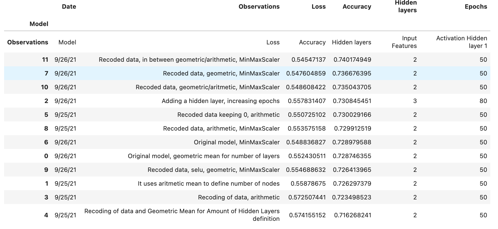

# Venture Funding with Deep Learning

Alphabet Soup venture capital needs assistance to allocate funds. Its business team receives many funding applications from startups every day. This team needs to create a model that predicts whether applicants will be successful if Alphabet Soup funds them.

The business team provided data from more than 34,000 organizations that have received funding from Alphabet Soup over the years. Using machine learning and neural networks, we create a binary classifier model that will predict whether an applicant will become a successful business. The data contains various information about these businesses, including whether or not they ultimately became successful.

We use deep learning, and the best-fitted model can predict about 3 out of 4 outcomes correctly (74% accuracy). 

In this project, we tune the model by adjusting several parameters. We have kept the alternative models and present a comparison in terms of accuracy. We generated 11 models, adjusting for:

* the number of layers, 
* the activation functions, 
* the recoding of the data, 
* the standardization versus normalization of the data in preparation, 
* the number of epochs, and 
* the methods applied to categorical data.

## Technologies

The project uses the following technologies:

* `Pandas,` `NumPy` for general programming in Jupyter Lab

* `TensorFlow` and `Keras` for the construction and evaluation of the Deep Learning models. Particularly *Sequential* for the fitting, compilation, and evaluation, and *Dense* for the layer construction. We use a version above 2.0.0.

* `SKLearn` for the preprocessing of the data, particularly `StandardScaler` and `MinMaxScaler` for standardization and normalization; `OneHotEncoder` for treatment of the categorical variables, and `train_test_split` for the separation of the sample in a set to train and a set to validate the model.

## Installation Guide
The file is a jupyter notebook. If you don't have jupyter lab, you can install it following the instruction here:

https://jupyterlab.readthedocs.io/en/stable/getting_started/installation.html

If you don't have installed TensorFlow, you can run the following command

`pip install --upgrade tensorflow`

### Usage

The main file is `Main_venture_funding_with_deep_learning.ipynb`, which contains the original model, the results, and the conclusions. Others similarly called files are different alternative models (such as `1venture_funding_with_deep_learning_Alternative.ipynb`, `2venture_funding_with_deep_learning_Alternative.ipynb` and so on).

Results and comparisons are displayed in the main file as well.

These are jupyter notebooks with a pre-run code. You can go through it and see code as well as results. 

If you want to reuse the code and do not have experience in jupyter lab, please refer:
https://www.dataquest.io/blog/jupyter-notebook-tutorial/

The table of final results of all models is as in the table below, with a concise description of the variation on the Observation columns. For the model construction details, you must go to the model file itself.

## Contributors
This project was coded by Paola Carvajal Almeida, paola.antonieta@gmail.com.

Contact email: paola.antonieta@gmail.com
LinkedIn profile: https://www.linkedin.com/in/paolacarvajal/

## License
This project uses an MIT license. This license allows you to use the licensed material at your discretion, as long as the original copyright and license are included in your work files. This license does not contain a patent grant and liberates the authors of any liability from using this code.
